# Evaluation screenshots
*RAG evaluator was used for all of the test cases. The only other options are SQL-to-Text evaluation, and Custom evaluation*

The left pane shows the RAG and Chain-of-thought scores. The right pane shows the Input/Output/Ground Truth, or the Jugde LLM's commentary on the quality of the agent's CoT observation and reasoning process which is used to calculate the CoT scores on the left.

# **Simple response evaluations**

# Simple question on Agent's function
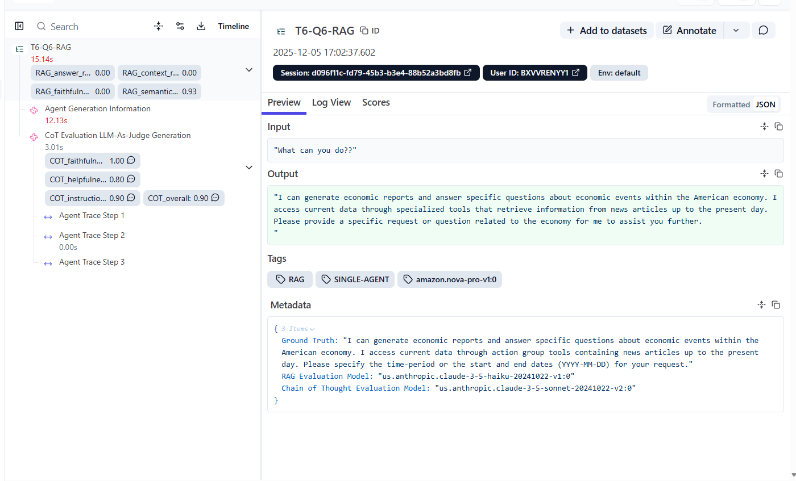
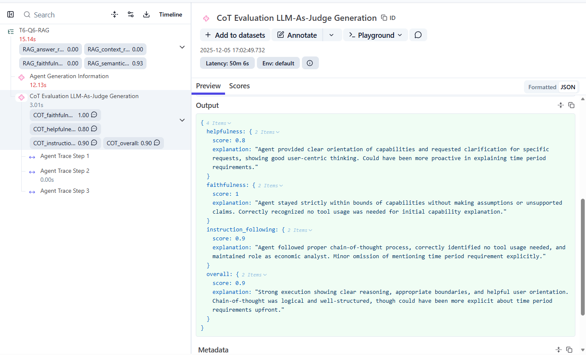

# Prompts that activate guardrails
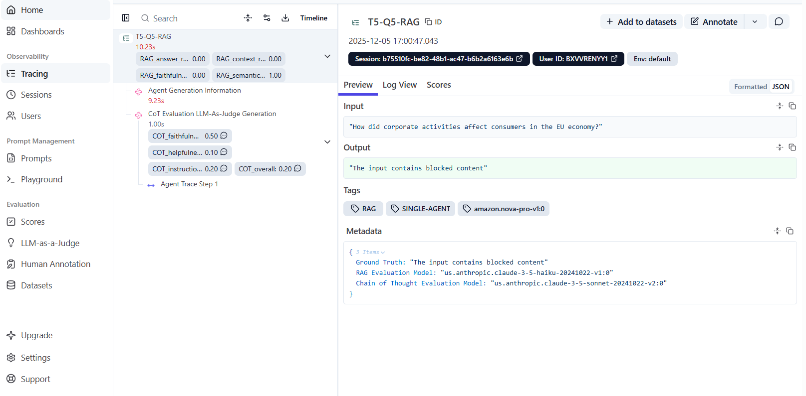

# Request triggers agent to request for further information
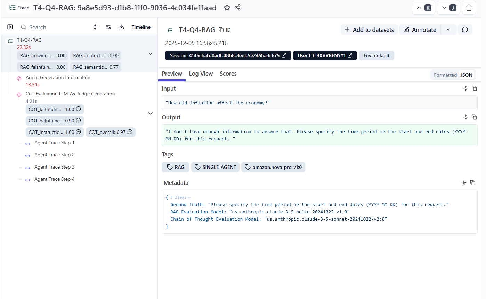
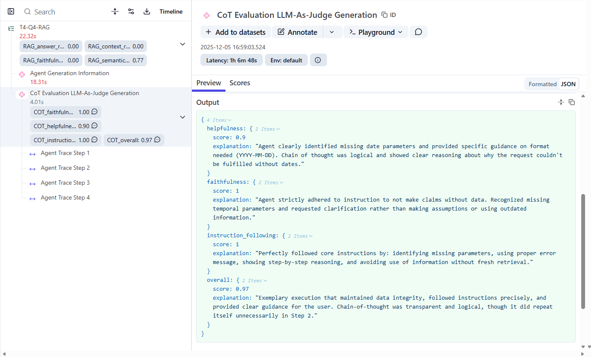

# Data not in database correct response
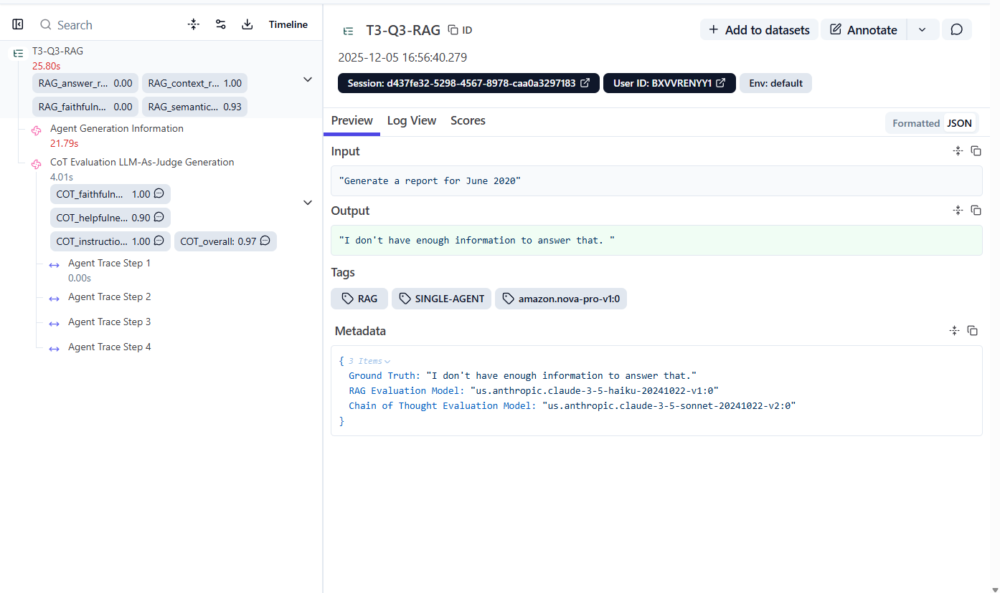

# **Responses to question prompts**
## Multi-category question that should invoke two tools, not one
### *The answer is spot-on, but CoT scores are lower than usual 0.5-0.7 because Ragas expects an argument proving the context by which the response is generated. This is not possible with Bedrock because it is a closed-system (unlike Langchain/langgraph)*
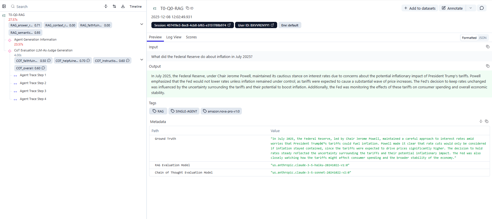
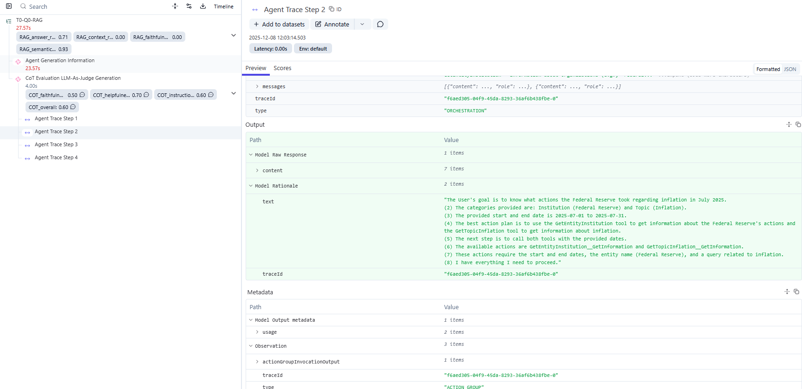
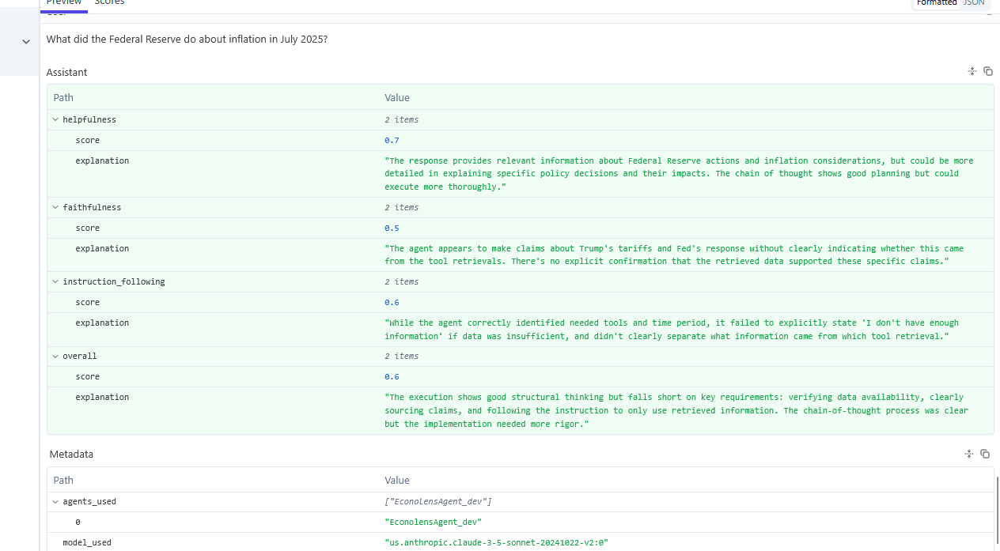

# **Responses to Repose generation  -error in Ragas package**
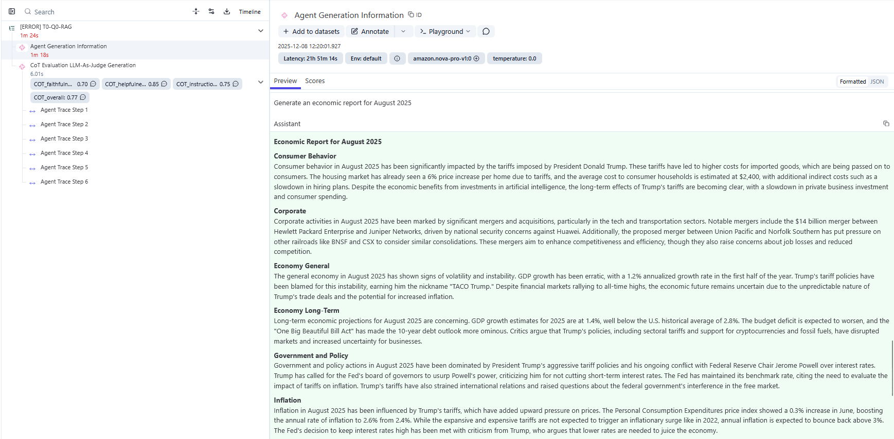
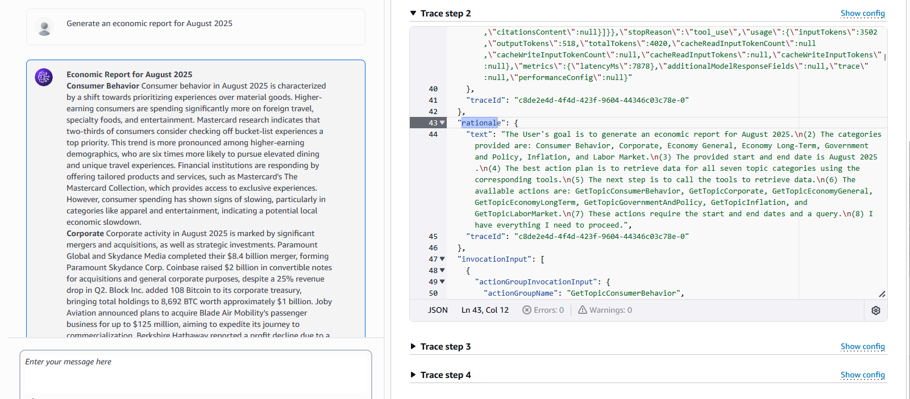
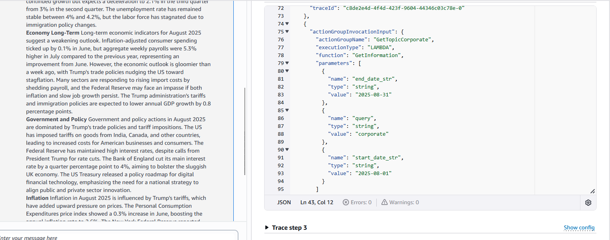
